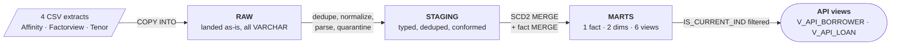
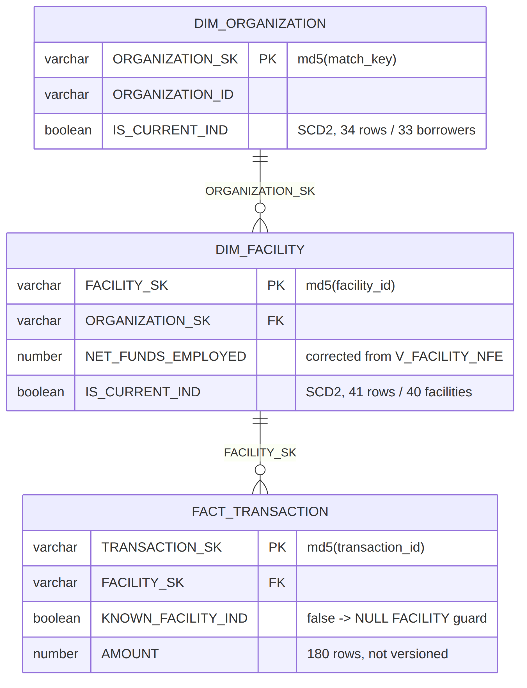
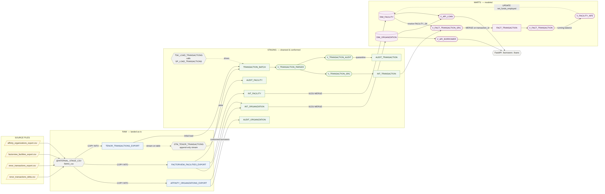

# Private Credit Data Platform

A layered Snowflake build over three siloed sources (Factorview for loan servicing, Affinity
for CRM, and Tenor for fund accounting), with `RAW` → `STAGING` → `MARTS`, an SCD2 star schema, a
stream-and-task pipeline that processes new Tenor activity automatically, three read-only
roles, and a local FastAPI service that reads and writes through the mart.

## Running it from a fresh clone

### Prerequisites

- `uv`, and a Snowflake connection in `~/.snowflake/connections.toml` named `assessment`
  (`00_run_all.sh` reads `SNOWFLAKE_CONNECTION`, falling back to that name).
- The connecting user needs `CANDIDATE_CALLAHAN` plus the three Part 5 roles, since
  `pt5/05-verify.sql` switches into each of them.
- Run from the repo root — `pt3/04-load-delta.sql` PUTs a repo-relative path.
- The four source CSVs are committed under `pt2/01_raw/source_data/`.

### One command

```bash
uv sync
./00_run_all.sh -y
```

`-y` skips the destructive-action prompt. The script drops and rebuilds `RAW`, `STAGING` and
`MARTS` from the CSVs, in order: `pt1` schemas → `pt2` raw load/staging/marts → `pt3`
stream/task/delta load, then waits for the task to drain the stream → `pt4` analytics/verification
→ `pt6` API views → `pt5` LP view/roles/grants/verification (`pt5` runs again at the end because
the three roles are account-level and survive the schema teardown).

Five to ten minutes, mostly waiting on the task, which fires within ~30s of rows landing.
`set -euo pipefail` aborts at the first failing statement; the last `==>` marker names the file
that failed. Statements run in one `snow sql` session, so a password+MFA account is prompted a
handful of times rather than twenty.

Afterwards the pipeline is live: anything landing in `RAW.TENOR_TRANSACTIONS_EXPORT` from that
point on is picked up automatically. Two demo scripts (Part 3, below) are left to run by hand.
The API is a separate step (Part 6).

## Part 1: Data model

`RAW`, `STAGING` and `MARTS` are created in `pt1/01-schemas.sql`. Deployed MARTS DDL:
[`docs/marts-ddl.sql`](docs/marts-ddl.sql) — two SCD2 dimensions, one fact table, three views:
`V_FACT_TRANSACTION_SRC` resolves the facility key and prefers Factorview's fund description
over Tenor's where they disagree; `V_FACT_TRANSACTION` adds a running balance per facility;
`V_FACILITY_NFE` turns that balance into corrected net funds employed.

**Grain.** `DIM_ORGANIZATION`: one row per borrower per version, 34 rows (33 borrowers + a
`NULL ORGANIZATION` guard). `DIM_FACILITY`: one row per facility per version, 41 rows (40 +
`NULL FACILITY` guard). `FACT_TRANSACTION`: one row per Tenor transaction, 180 rows, not
versioned — transactions are events that already happened, so corrections supersede rather than
rewrite history. Dimensions use SCD2 so point-in-time analysis and full history stay available.

**Keys.** Every table joins on an MD5 surrogate key; the natural key rides along but is never
joined on. `FACILITY_SK = md5(facility_id)`, `TRANSACTION_SK = md5(transaction_id)`,
`ORGANIZATION_SK = md5(match key)` (below). `SCD_ID` is the row identifier the merge matches on;
any join to a dimension must filter `IS_CURRENT_IND` or it fans out once per historical version.
`FACT_TRANSACTION.FACILITY_SK → DIM_FACILITY` and `DIM_FACILITY.ORGANIZATION_SK →
DIM_ORGANIZATION` are both total, zero orphans — handled with NULL-guard rows rather than null
field values. `INV-70005` cites a facility Factorview has never heard of, so it points at the
`NULL FACILITY` row with `KNOWN_FACILITY_IND = false`: countable and excluded from balances
rather than dropped.

**Borrower identity.** Factorview and Affinity share no borrower key, only a name, spelled
differently. 8 of 40 facilities fail an exact-name join, across 6 distinct client names. Both
systems normalize the name the same way (upper-case, strip punctuation, strip one trailing legal
suffix `LLC|INC|CO|LP|LTD|CORP|COMPANY`), and `ORGANIZATION_SK` hashes that match key rather than
the raw name, so `COBALT WORKING CAPITAL LLC` and `COBALT WORKING CAPITAL` resolve to the same
key by construction — 6 of 8 resolved. The remaining two, `KINGSFORD RECEIVABLES` and
`DUNMORE FUNDING LLC`, are borrowers Affinity has no record of at all, so `DIM_ORGANIZATION` is a
conformed dimension fed by both systems rather than an Affinity mirror: they get their own rows
tagged `SOURCE_SYSTEM = 'FACTORVIEW'` with null CRM attributes and a deterministic id.

**Extensibility.** A third system's borrowers normalize through the same match key and hash to
the same `ORGANIZATION_SK`, so they merge into an existing borrower or arrive as a new row
carrying their own `SOURCE_SYSTEM` tag — nothing downstream changes, since joins are on the
surrogate key, never on a name. The three-layer split supports this: RAW is per-source and
append-only, STAGING conforms each source to a shared shape, MARTS is source-agnostic. A new
system adds a RAW table and a STAGING script and leaves the marts merge logic untouched.

### Diagram: 3 Layer Data-Flow



## Part 2: see files at `pt2/`

### Diagram: Kimball Star Schema 



### Diagram: Pipeline DAG 


## Part 3: Incremental processing

`RAW.STM_TENOR_TRANSACTIONS` (append-only stream) feeds `TSK_LOAD_TRANSACTIONS`, a triggered
task calling `STAGING.SP_LOAD_TRANSACTIONS()`, which drains the stream and runs the same
cleansing views as the initial load, so parsing, dedup and balance rules have one definition.
All three hops run in a single transaction.

### What the pipeline did with each row of the delta file

`INV-70001`, `INV-70002` and `INV-70003` were ordinary new remittances and were inserted,
lowering net funds employed on FV-1001, FV-1011 and FV-1023. `INV-70004` was also inserted
even though Factorview marks FV-1036 CLOSED, and the pipeline logged that discrepancy as a
soft observation in `CALLAHAN_DB.STAGING.DATA_QUALITY_LOG`. `INV-50100` was an identical
re-send of a row from the initial export, so the MERGE matched it on `TRANSACTION_ID`, found
`CHANGE_TRACKING_KEY` unchanged, and did nothing. `INV-70005` cites FV-9201, which does not
exist in Factorview, so the row was kept, pointed at the `NULL FACILITY` surrogate key, marked
`KNOWN_FACILITY_IND = false`, and excluded from the net-funds-employed refresh so it could not
corrupt a real facility's balance.

### Verifying the delta run

`pt3/05-verify.sql` runs as the last step of the Part 3 sequence in `00_run_all.sh`:

| Check | Expected on a fresh build |
|---|---|
| Task history | at least one `SUCCEEDED`, `error_message` null |
| Stream state | `stream_has_data` false: the task drained it |
| Row counts | `raw_rows` 182, `fact_rows` 180, `fact_distinct_ids` 180, `audit_rows` 2 |
| Delta disposition | `INV-70001` through `INV-70005` carry this run's `record_inserted_ts`; `INV-50100` still carries the initial load's, because the re-send matched and did nothing |
| NFE movement | exactly 4 facilities: FV-1001 −33,565.12, FV-1011 −71,931.08, FV-1023 −16,091.32, FV-1036 −50,693.51 |
| Referential integrity | 0 orphan facilities and 0 duplicate organization keys in both staging and marts; the dimension join returns 41 rows, equal to `DIM_FACILITY`, so it does not fan out |
| Borrower provenance | `AFFINITY` 31, `FACTORVIEW` 2 |

### Demonstrating idempotency

`pt3/06-resend-delta.sql` re-COPYs the entire delta file with `force = true`, the
fund-administrator-resends-a-file case:

```bash
uv run snow sql -f pt3/06-resend-delta.sql
sleep 60
uv run snow sql -f pt3/05-verify.sql
```

| | Before | After |
|---|---|---|
| `raw_rows` | 182 | **188**: RAW is append-only, so the re-send does land |
| `fact_rows` / `fact_distinct_ids` | 180 / 180 | **180 / 180** (unchanged) |
| NFE movement | 4 facilities | **the same 4 rows, the same amounts** |

Every re-sent row matched on `TRANSACTION_ID` with an unchanged `CHANGE_TRACKING_KEY`, so the
MERGE did nothing — idempotency lives in the merge key, not the loader, which is why the
duplicate reaches RAW and stops there.

### Demonstrating quarantine

`pt3/07-quarantine-demo.sql` inserts two deliberately broken rows into RAW: one with an
unparseable date and a non-numeric amount (`32-Foo-99` / `not-a-number`), one with a null
`transaction_id`:

```bash
uv run snow sql -f pt3/07-quarantine-demo.sql
sleep 60
uv run snow sql -q "select count(*) from callahan_db.staging.audit_transaction"
```

The second print happens before the task has fired, hence the separate check:
`AUDIT_TRANSACTION` goes from 2 to **4** and `FACT_TRANSACTION` stays at **180** — neither bad
row reaches the fact table, and neither is silently dropped. Run this script once: the load path
lacks the anti-join the initial load uses, so re-running it double-writes the audit rows (facts
stay correct regardless, since that merge is keyed on `TRANSACTION_ID`).

## Part 4: SQL analytics

One script per question in `pt4/`, plus `pt4/05-verify.sql`. All read-only. Every query filters
`IS_CURRENT_IND` on both dimensions and excludes the `NULL FACILITY` and `NULL ORGANIZATION`
guard rows. Results below are from a fresh `./00_run_all.sh` build, with no hand-posted
remittances, so they reproduce exactly.

### Total outstanding balance

**$51,307,728.71 across 40 facilities.** `NET_FUNDS_EMPLOYED` is the Tenor running balance
(Part 2's conflict resolution), so this is the transaction ledger's view of funds deployed,
not Factorview's stated one.

| Status | Facilities | Outstanding | % of total |
|---|---:|---:|---:|
| ACTIVE | 26 | $28,979,443.58 | 56.48 |
| WATCH-LIST | 6 | $10,680,166.51 | 20.82 |
| CLOSED | 4 | $5,735,894.23 | 11.18 |
| PAID-OFF | 3 | $5,092,494.75 | 9.93 |
| UNKNOWN | 1 | $819,729.64 | 1.60 |

Missing and invalid balances fall into three cases:

- **Blank in the source.** FV-1008 and FV-1022 arrive from Factorview with no NFE. Tenor
  supplies a real balance for both, $2,313,722.94 and $530,858.86, so neither is dropped or
  assumed zero. No facility in the mart has a null balance.
- **Outside the total.** Five transactions cite facilities Factorview has never seen
  (FV-9101 through FV-9104, FV-9201). They sit on the `NULL FACILITY` guard and move no facility
  balance, so $70,385.05 of remittance is outstanding somewhere outside the $51.31M — a
  reconciling item rather than something netted in silently.
- **Closed but not zero.** $10,828,388.98 across seven facilities sits on statuses Factorview
  calls CLOSED or PAID-OFF, because Tenor's history never remits them to zero. The discrepancy
  is Factorview's status field, not the ledger, so the balance stands and the status breakdown
  above makes the amount visible.

The UNKNOWN row is FV-1004, whose status Part 2 nulled when its two source copies disagreed.

### Top 5 borrowers by outstanding exposure

Open means `ACTIVE` or `WATCH-LIST` — watch-list is a credit-risk flag, not a lifecycle state,
and the money is still out. Exposure aggregates at the borrower, so Copper Elm's two facilities
count once. The open portfolio is $39,659,610.09, 77.30% of the portfolio.

| Borrower | Facilities | Exposure | % of open portfolio | % of portfolio |
|---|---:|---:|---:|---:|
| COPPER ELM FACTORING, INC. | 2 | $4,053,787.54 | 10.22 | 7.90 |
| SHORELINE COMMERCIAL FINANCE | 2 | $3,358,130.15 | 8.47 | 6.55 |
| HARBOR REACH FUNDING | 1 | $3,021,553.55 | 7.62 | 5.89 |
| LONGVIEW TRADE CREDIT | 2 | $2,963,409.31 | 7.47 | 5.78 |
| ELMGROVE CAPITAL PARTNERS LP | 1 | $2,305,759.29 | 5.81 | 4.49 |

The table gives both denominators because "share of total portfolio exposure" reads either way.
The filter holds back $11,648,118.62: CLOSED (4 facilities, $5,735,894.23), PAID-OFF (3,
$5,092,494.75) and FV-1004 ($819,729.64), whose status is unproven and so is not grounds for
calling it open. `pt4/02` lists them.

### Monthly remittance totals for 2025, by fund

`FACT_TRANSACTION` normalizes fund names by deferring to Factorview wherever the facility is
known. The five orphan transactions get no such override and keep Tenor's spelling, so `pt4/03`
folds `ABL Fund` and `Fund I` onto their Factorview equivalents before grouping. Remittances are
positive here: cash received, which `V_FACILITY_NFE` sign-flips into a reduction in funds
employed.

| Month | Cardinal ABL & Factoring Fund | Cardinal Lender Finance Fund I | Total |
|---|---:|---:|---:|
| 2025-01 | $0.00 | $334,626.26 | $334,626.26 |
| 2025-02 | $0.00 | $253,441.48 | $253,441.48 |
| 2025-03 | $634,609.71 | $895,913.88 | $1,530,523.59 |
| 2025-04 | $62,990.22 | $666,266.04 | $729,256.26 |
| 2025-05 | $271,175.05 | $529,790.76 | $800,965.81 |
| 2025-06 | $363,370.97 | $195,116.11 | $558,487.08 |
| 2025-07 | $0.00 | $339,273.09 | $339,273.09 |
| 2025-08 | $0.00 | $438,367.07 | $438,367.07 |
| 2025-09 | $0.00 | $85,293.36 | $85,293.36 |
| 2025-10 | $0.00 | $0.00 | $0.00 |
| 2025-11 | $30,920.60 | $25,224.70 | $56,145.30 |
| 2025-12 | $0.00 | $0.00 | $0.00 |
| **2025** | **$1,363,066.55** | **$3,763,312.75** | **$5,126,379.30** |

`pt4/03` generates the month grid instead of deriving it from the data, so a month with no
activity reports zero instead of going missing — October and December are genuinely empty, not
dropped. All four of November's remittances are orphans citing FV-9101 through FV-9104; that
month is entirely cash the mart cannot attribute to a facility. Those rows stay in the fund
totals, since the cash moved regardless of facility registration — only facility-level balances
exclude them.

### Outstanding exposure by industry

Industry is an Affinity attribute and balances come from Factorview and Tenor, so the join
strategy is the question. **Matching on the raw name loses 8 of 40 facilities.** Part 2
normalizes both sides to the same match key and hashes it into `ORGANIZATION_SK`, making the
foreign key total, so `pt4/04` is a plain left join off the facility — left rather than inner so
a facility cannot drop out on a miss.

| Industry | Borrowers | Facilities | Exposure | Open exposure | % of total portfolio |
|---|---:|---:|---:|---:|---:|
| Transportation & Logistics | 3 | 6 | $8,249,765.77 | $7,637,716.28 | 16.08 |
| INDUSTRY NOT SET | 4 | 5 | $7,487,920.86 | $7,487,920.86 | 14.59 |
| Manufacturing | 3 | 5 | $4,893,977.52 | $4,074,247.88 | 9.54 |
| Oil & Gas Services | 2 | 3 | $4,791,574.76 | $4,053,787.54 | 9.34 |
| Healthcare Staffing | 2 | 3 | $3,644,109.82 | $3,644,109.82 | 7.10 |
| Seafood Processing | 1 | 1 | $3,021,553.55 | $3,021,553.55 | 5.89 |
| NOT IN CRM | 2 | 2 | $2,869,108.14 | $2,869,108.14 | 5.59 |
| Staffing Services | 2 | 2 | $2,824,526.73 | $363,812.74 | 5.51 |
| Furniture Manufacturing | 1 | 1 | $2,590,915.69 | $0.00 | 5.05 |
| Agriculture | 1 | 1 | $2,359,895.00 | $0.00 | 4.60 |
| Construction | 2 | 3 | $2,284,730.31 | $2,012,844.55 | 4.45 |
| Import/Export | 1 | 1 | $1,795,141.83 | $0.00 | 3.50 |
| Metals & Mining Services | 1 | 1 | $1,648,721.04 | $1,648,721.04 | 3.21 |
| Apparel & Textiles | 2 | 2 | $1,152,272.36 | $1,152,272.36 | 2.25 |
| Technology Services | 1 | 2 | $891,127.86 | $891,127.86 | 1.74 |
| Wholesale Distribution | 1 | 1 | $470,836.85 | $470,836.85 | 0.92 |
| Pharmaceuticals Distribution | 1 | 1 | $331,550.62 | $331,550.62 | 0.65 |

Unmapped borrowers get two labels rather than one bucket, since the two cases need different
follow-up:

- **NOT IN CRM** ($2,869,108.14). KINGSFORD RECEIVABLES and DUNMORE FUNDING LLC hold facilities
  in Factorview and have no Affinity record. Someone has to create one.
- **INDUSTRY NOT SET** ($7,487,920.86). LONGVIEW TRADE CREDIT, ELMGROVE CAPITAL PARTNERS LP,
  BROOKFIELD ASSET LENDING and BAYLINE COVE FINANCE have CRM records whose industry field is
  blank. Someone has to fill it in.

Together they are 20.19% of the book, most of it in the second bucket. An inner join would have
hidden all of it. The `~NULL~` sentinel never reaches output.

`pt4/05-verify.sql` guards the expressions the four scripts repeat: industry exposure reconciles
to the $51,307,728.71 headline, no facility reaches output unlabelled, all five orphan
transactions stay off real facilities, and the generated month grid totals $5,126,379.30, equal
to the ungridded 2025 sum.

**Known limitation.** Fund-name normalization lives in the Factorview override, not staging, so
it only fires for transactions with a known facility; `pt4/03` compensates with an explicit
`CASE`, duplicating the mapping. The durable fix is normalizing `FUND_DESCRIPTION` in
`pt2/02_staging/03-clean-transaction.sql` so it applies regardless of whether the facility
resolves.

## Part 5: see files in `pt5/`

## Part 6: REST API

A local FastAPI service in `pt6/`, talking to `CALLAHAN_DB` through the Snowflake Python
connector. No BI tool, no wrapper.

### Running it

```bash
cp pt6/.env.example pt6/.env      # then fill it in; pt6/.env is gitignored
uv sync
uv run snow sql -f pt6/00-api-views.sql
uv run uvicorn app.main:app --app-dir pt6 --port 8000
```

Swagger UI at http://127.0.0.1:8000/docs. `--app-dir` keeps the repo from having to be an
installable package. `pt6/00-api-views.sql` also runs as part of `00_run_all.sh`, so after a
full rebuild only the last line is needed.

Leave `--reload` off: each reload re-opens the Snowflake connection, which on an MFA account
means another push. `pt6/.env` must point at the same account the rebuild targeted, or the API
will read a database the rebuild did not build. A startup crash naming missing environment
variables is `db.py` working as designed.

Tests are `uv run pytest pt6/test_api.py -v`: ten cases, all read-only, all against live
Snowflake with no mocks. They cover filtering, pagination, the 404 borrower, the status-bucket
reconciliation, and every error path on `POST /remittances` except the success case, which is
excluded deliberately because it moves a real balance.

### How it connects

Everything comes from the environment. There is no account, user or secret anywhere in the
source, and the service never learns which account it is pointed at:

| Variable | Notes |
|---|---|
| `SNOWFLAKE_ACCOUNT`, `SNOWFLAKE_USER` | |
| `SNOWFLAKE_ROLE` | `CANDIDATE_CALLAHAN` |
| `SNOWFLAKE_WAREHOUSE`, `SNOWFLAKE_DATABASE` | `WH_CALLAHAN`, `CALLAHAN_DB` |
| `SNOWFLAKE_AUTHENTICATOR` | `snowflake_jwt` or `username_password_mfa` |
| `SNOWFLAKE_PRIVATE_KEY_FILE`, `SNOWFLAKE_PRIVATE_KEY_FILE_PWD` | key pair only |
| `SNOWFLAKE_PASSWORD` | password + MFA only |

`db.py` requires the five common variables plus whichever pair the chosen authenticator needs,
failing at startup naming any that are missing rather than erroring on the first request.
`~/.snowflake/connections.toml` is deliberately not used: it is key-pair-only and machine-local,
where env vars work the same way on either account.

### The read surface

`pt6/00-api-views.sql` creates `MARTS.V_API_LOAN` and `MARTS.V_API_BORROWER` (`IS_CURRENT_IND`
filter, guard-row exclusion, `~NULL~` nulled — once, not once per endpoint); every handler reads
only those. `V_API_LOAN` left-joins the borrower so a facility can't vanish by pointing at a
guard row. Self-check on creation: `v_api_loan` 40/40 facilities, all mapped to a borrower;
`v_api_borrower` 33/33.

### Exercising it

Five commands covering the graded behaviours. The service emits compact JSON, so the `grep`
patterns carry no space after the colon.

| Command | Expected |
|---|---|
| `curl -s "localhost:8000/loans?status=ACTIVE" \| grep -o '"total":[0-9]*'` | `"total":26`; `WATCH-LIST`, `CLOSED`, `PAID-OFF` give 6, 4, 3, and `?status=active` matches `ACTIVE` |
| `curl -s "localhost:8000/loans?fund=cardinal%20lender%20finance%20fund%20i" \| grep -o '"total":[0-9]*'` | `"total":26`: a fund with no facilities is `200` with `"total":0`, not a `404` |
| `curl -s "localhost:8000/loans?limit=5&offset=5" \| python3 -m json.tool \| head` | `"total":40` with five items, FV-1006 through FV-1010; `limit=201` is a `422`, the bound being 1 to 200 |
| `curl -s -w ' HTTP=%{http_code}\n' localhost:8000/borrowers/AFF-9999/loans` | `404`, `BORROWER_NOT_FOUND`. `AFF-2029` exists with no facilities and is a `200` with `"loans":[]` |
| `curl -s -X POST localhost:8000/remittances -H 'Content-Type: application/json' -d '{"facility_id":"FV-1001","amount":-1,"transaction_date":"2026-01-01"}'` | `400`, `AMOUNT_NOT_POSITIVE`. A non-numeric `amount` is `422`, and an unknown `facility_id` is `404` |

`GET /portfolio/summary` returns `total_outstanding` 51307728.71, `loan_count` 40,
`facilities_missing_balance` 0, and a `loans_by_status` array whose counts sum to 40 and whose
`outstanding` values sum to the total, including a bucket with `"status": null` holding FV-1004.
`top_borrowers` matches the Part 4 table, headed by COPPER ELM at $4,053,787.54, with
`share_of_total` expressed as a fraction.

### `POST /remittances` end to end

The one path that crosses API → `RAW` → stream → task → `MARTS`, and the one the test suite
leaves alone. Capture the balance first:

```bash
uv run snow sql -q "select facility_id, net_funds_employed from callahan_db.marts.dim_facility
                    where facility_id = 'FV-1001' and is_current_ind"

curl -s -X POST localhost:8000/remittances -H 'Content-Type: application/json' \
  -d '{"facility_id":"FV-1001","amount":25000.00,"transaction_date":"2026-08-09","share_class":"Class A"}'
```

The response is `201` with `"status": "accepted"` and a `transaction_id` like `API-xxxxxxxx`.
After about 45 seconds, each hop should hold that id:

| Hop | Expected |
|---|---|
| `RAW.TENOR_TRANSACTIONS_EXPORT` | one row, `transaction_date` written as `09-Aug-26` |
| `MARTS.FACT_TRANSACTION` | one row, date parsed to `2026-08-09`, amount 25000, `known_facility_ind` true |
| `STAGING.AUDIT_TRANSACTION` | count unchanged: a clean row must not be audited |
| `DIM_FACILITY.NET_FUNDS_EMPLOYED` on FV-1001 | exactly 25,000.00 lower, and `/portfolio/summary` follows |

If the API's number lags the warehouse's, the task has not fired yet; nothing needs restarting.
The `DD-MON-YY` value in RAW is the point of the check — see the first known limitation below.

### Design decisions

- `POST /remittances` writes to `RAW`, not `MARTS`, so it inherits Parts 2/3's parse/dedup/
  quarantine rules instead of opening a second unvalidated path; `201` means "accepted," and the
  response says so.
- `{id}` in `/borrowers/{id}/loans` is `ORGANIZATION_ID` — stable, unlike a name. No facilities
  is `200 []`; an unknown id is `404`.
- Money serializes as JSON numbers (this is a read-mostly reporting API, not a ledger).
- Schema violations are `422`; business-rule violations (e.g. non-positive `amount`) are enforced
  in the handler and returned as `400`, since the brief asks for `400` there. Every failure comes
  back in one envelope: `{ "error": { "code": ..., "message": ..., "detail": ... } }`.
- `share_class` is an enum, not free text, so staging doesn't gain a third spelling of
  `Class A`.

### Known limitations

- **`POST /remittances` must write dates in `DD-MON-YY`.** It accepts ISO but inserts into
  `RAW.TENOR_TRANSACTIONS_EXPORT`, which staging parses with `try_to_date(..., 'dd-mon-yy')`; an
  ISO date there parses null and gets quarantined, so the API reformats on the way in. Durable
  fix: widen the staging parser.
- **FV-1004 is unreachable through `?status=`.** Its status is null (two source copies
  disagreed) and `LoanStatus` has no null member, so `?status=UNKNOWN` is `422`. It still appears
  in an unfiltered `GET /loans` and as a `null` bucket in `/portfolio/summary`.
- **One Snowflake connection, opened at startup.** Password+Duo MFA with no key pair means
  connecting per request would push on every call, so the API opens one connection in a
  `lifespan` handler (`client_session_keep_alive=True`) and relies on
  `ALLOW_CLIENT_MFA_CACHING = TRUE` to keep restarts silent. Keep `--reload` off. Fine for a
  local single-user service; production needs a pool.
- **One role for reads and writes.** The service connects as `CANDIDATE_CALLAHAN`, since the
  read-only Part 5 roles can't serve `POST /remittances`; production would split read traffic
  onto a read-only role.

## Part 7: README wrap-up and design questions

### Architecture overview

The layer rationale, keys, grain and borrower-identity design are in
[Part 1](#part-1-data-model); the load → parse → merge mechanics and the delta-file walkthrough
are in [Part 3](#part-3-incremental-processing).

### AI usage disclosure

AI (Claude, via Claude Code) was used throughout — schema and DDL design, the staging/marts SQL,
the stream-and-task pipeline, the FastAPI service, and this README. Data modeling and SQL
analytics needed the least steering; shell scripting, API construction, and systematic debugging
drew more on it.

When I have more experience on what "good code" looks like, I generally start the implementation myself
and then work with Claude to scale up my initial code so it is more robust and handles edge cases.

When I am in more unknown territory, I do a session or two of planning and research, outlining a strong
document that guides the AI Execution throughout the task. I then iteratively execute against
that document, incrementally implementing, testing, refactoring, and driving onto the next task as needed.

For writing, I generally do my own research on the task at hand (do my own analytics queries, for example),
bullet-point notes of what I found, and refine my investigation using Claude. Once I have all 
the required questions answered, I work with Claude to refine my bullet-point notes into a longer document

#### Claude Pushbacks

Places where an AI suggestion was rejected or materially changed:

1. **A deployed UDF for borrower-name matching was rejected in favor of inline SQL.** The
   original design called for a Snowflake UDF, `FN_BORROWER_MATCH_KEY`, invoked from both
   cleansing scripts. It shipped instead as the same three-line expression written inline at
   each of its three call sites — the function had no remaining consumer once the Part 6 API
   view was simplified to a plain join on `ORGANIZATION_SK`, so a deployed object would have
   existed for two call sites that can just duplicate a short expression.
2. **The STAGING layer was not allowed to accumulate.** An early version of
   `03-clean-transaction.sql` configured `int_transaction` as a forever-growing table, but it's
   meant to process incremental batches — the pipeline should grow at one or both ends, never in
   the middle. It ships as a truncate-reload table instead.
3. **A running balance moved from a stored column into a view.** The initial design materialized
   `facility_balance` directly onto each `FACT_TRANSACTION`, correct once and then out of sync
   after the first delta. The balance now lives in `V_FACT_TRANSACTION`, computed fresh from
   whatever is currently in the fact table, so it cannot drift.

### What I would do if I had one more week

Priority order follows the known limitations already called out:

- **Staging date parsing that accepts ISO input**, so `POST /remittances` (Part 6's first known
  limitation) can insert an ISO date instead of reformatting to `DD-MON-YY`.
- **Fund-name normalization moved into staging** (Part 4's known limitation), so it applies to
  every transaction, not only ones with known facilities.
- **The `AUDIT_TRANSACTION` anti-join guard** used by the initial load, applied inside
  `SP_LOAD_TRANSACTIONS` too (Part 3's known limitation), so a re-sent file with audit-worthy
  rows can't double-write its audit trail.
- **An explicit `UNKNOWN` status filter value** on `GET /loans` (Part 6's second known
  limitation), so FV-1004 is reachable through `?status=`.
- **Split read/write roles for the API** (Part 6's design decisions), so the service doesn't run
  as `CANDIDATE_CALLAHAN` for every request.
- **Implement the pipeline as a [dbt project](https://www.getdbt.com/)** for self-documentation,
  lineage, contracts, and unit testing.

### Design questions

**1. Production ingestion from a rate-limited REST API.**
As I am new to API engineering, I chose to defer this question.

**2. Snowflake-native daily scheduling and failure monitoring.** With Snowflake-native features
alone, a dedicated warehouse runs tasks triggered by an always-on stream calling a stored
procedure — the pipeline is event-driven, deferring to the upstream source's ingestion schedule
rather than keeping its own. Without a third-party orchestrator, monitor failures either with
[Snowflake Alerts](https://docs.snowflake.com/en/user-guide/alerts) notifying key personnel on a
pipeline error or serious data issue, or by refactoring the pipeline as a dbt project hosted via
GitHub Actions (still event-driven: the task calls a Python function that triggers the Actions
job, which triggers dbt, in response to `SYSTEM$STREAM_HAS_DATA()`).

**3. Idempotency on a re-sent file.** Proven in "Demonstrating idempotency" above: the fact
MERGE is keyed on `TRANSACTION_ID` with a `CHANGE_TRACKING_KEY` comparison, so a re-sent row
carrying no new information matches and updates nothing. RAW still grows, being append-only by
design, but no balance moves and no duplicate reaches the mart. What's missing is a file-level
guarantee rather than a row-level one: a load ledger keyed on file name and content checksum,
consulted before `COPY INTO` runs, so a whole re-sent file is recognized and skipped before it
reaches RAW, rather than relying on each row individually bouncing off the MERGE. (Snowflake's
own load history already prevents the same staged file object from loading twice by default; the
ledger would make that guarantee explicit and extend it to a file re-uploaded under the same name
with the same bytes.)

**4. Serving Excel users, SQL analysts, and AI-assisted querying from one MARTS layer.** Assuming
no dedicated BI tool (PowerBI, Tableau, Sigma) is available, Excel power-users connect through
Snowflake's native connector (or ODBC/JDBC) pointed at read-only views shaped like
`V_LP_PORTFOLIO_SUMMARY`. SQL analysts get direct role-based access to `MARTS` through roles like
the ones Part 5 builds (`CALLAHAN_ANALYST_RO`, `CALLAHAN_FINANCE`), querying the dimensional
model directly in Snowsight or their tool of choice. AI-assisted querying sits on the same layer
rather than a separate one:
[a semantic view](https://docs.snowflake.com/en/user-guide/views-semantic/overview) defined over
`MARTS` gives an LLM named metrics and dimensions instead of raw table access, running under one
of the Part 5 roles to keep its permission scope to its intended purpose.
